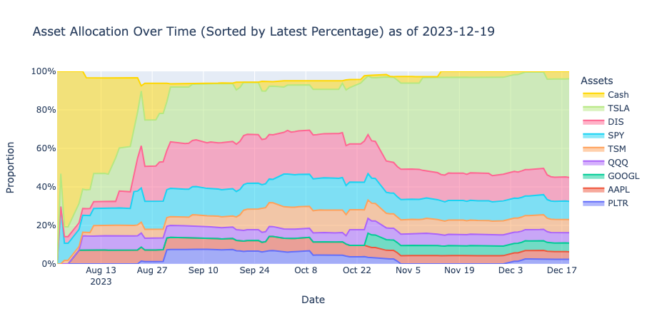

# Firstrade Portfolio Analysis

## Table of Contents

- [Introduction and Features](#introduction-and-features)
- [Files](#files)
- [Output Files](#output-files)
- [Setup](#setup)
- [Usage](#usage)
- [Visualizations and Example Output](#visualizations-and-example-output)
  - [Example HTML Output](#example-html-output)
  - [Sample Visualizations](#sample-visualizations)
  - [Portfolio Analysis Tables](#portfolio-analysis-tables)
- [Note](#note)
- [Appendix: Output File Structures](#appendix-output-file-structures)
  - [transaction_history.json Structure](#transaction_historyjson-structure)
  - [portfolio_history.json Structure](#portfolio_historyjson-structure)

## Introduction and Features

This project offers a comprehensive suite of Python scripts and a Jupyter notebook for in-depth analysis and visualization of your Firstrade investment portfolio. By meticulously reconstructing your complete transaction history from the Firstrade CSV file, it enables:

- Precise tracking of your portfolio's evolution from the very first trade
- Detailed performance analysis over any time period
- Accurate calculation of returns, including the compounding effects of dividends and reinvestments
- Proper handling of corporate actions like stock splits
- Insights into how different transaction types have impacted your overall performance

Key features include:

- Comprehensive transaction history processing (buys, sells, dividends, splits, etc.)
- Accurate portfolio state calculation and historical tracking
- Integration with yfinance for market data
- Realized and unrealized gain/loss calculations
- Performance metrics (total value, returns, deposits, etc.)
- Interactive Plotly visualizations:
  - Stock and sector proportions
  - Portfolio performance vs S&P 500
  - Asset allocation over time
- Customizable date range analysis
- HTML report generation
- Support for fractional shares and corporate actions

## Files

1. **portfolio_analysis_dashboard.ipynb**:
   This Jupyter notebook provides an interactive dashboard for analyzing your portfolio. It visualizes portfolio composition, performance metrics, and historical trends using interactive Plotly charts.

2. **transaction_history_processor.py**:
   This Python script processes the transaction history from Firstrade, calculates portfolio states, and provides methods for viewing and saving portfolio data.

3. **ft_history_processor.py**:
   This script handles the initial processing of the Firstrade CSV history file, converting it into a structured JSON format for further analysis.

## Output Files

The scripts generate several output files:

1.  `transaction_history.json`: Contains processed transaction data from the Firstrade CSV file.
2.  `portfolio_history.json`: Contains calculated portfolio states with market data over time.
3.  `portfolio_report_YYYY-MM-DD.html`: Generated by the notebook, these provide a comprehensive view of your portfolio analysis. Generated reports will be saved in the `reports/` directory.

## Setup

1. Install required packages:

   ```
   pip install -r requirements.txt
   ```

2. Download your transaction history from Firstrade as a CSV file and rename it to `FT_History.csv`. Place this file in the same directory as the scripts.

## Usage

1. Run the `ft_history_processor.py` script to convert the CSV file to a JSON format:

   ```
   python ft_history_processor.py
   ```

2. Run the `transaction_history_processor.py` script to process the JSON data and calculate portfolio states:

   ```
   python transaction_history_processor.py
   ```

3. Open `portfolio_analysis_dashboard.ipynb` in Jupyter to analyze your portfolio and generate HTML reports (saved in `reports/`) using the `generate_html_report()` function.

## Visualizations and Example Output

The notebook provides interactive visualizations and tables including:

- Portfolio composition and value distribution
- Sector allocation analysis
- Performance vs S&P 500
- Interactive features (zoom, pan, hover details)
- Customizable date ranges
- Sector breakdown with stock details on hover

These are compiled into an HTML report for easy viewing of portfolio performance and composition.

### Example HTML Output

To view an example HTML report:

1. Check the `reports/` directory for files named `portfolio_report_YYYY-MM-DD.html`
2. Open [this example report](reports/portfolio_report_2023-12-19.html) in your web browser

### Sample Visualizations:

<div style="display: grid; grid-template-columns: 1fr 1fr; gap: 10px; max-width: 800px; margin: 0 auto;">
  
  
  
  
</div>

The report includes interactive charts and detailed portfolio tables.

### Portfolio Analysis Tables

#### Portfolio Holdings

| Symbol | Quantity | Avg Cost  | Market Price | Total Cost | Market Value | Unrealized P/L   | Daily Change   |
| ------ | -------- | --------- | ------------ | ---------- | ------------ | ---------------- | -------------- |
| AAPL   | 10.00    | $150.00   | $175.00      | $1,500.00  | $1,750.00    | $250.00 (16.67%) | $25.00 (1.43%) |
| GOOGL  | 5.00     | $2,000.00 | $2,100.00    | $10,000.00 | $10,500.00   | $500.00 (5.00%)  | $50.00 (0.48%) |
| MSFT   | 15.00    | $200.00   | $220.00      | $3,000.00  | $3,300.00    | $300.00 (10.00%) | $30.00 (0.91%) |

#### Portfolio Summary:

- Cash: $1,523.45
- Total Value: $32,567.89
- Total Market Value: $31,044.44
- Total Deposits: $25,000.00
- Unrealized Profit/Loss: $2,279.12 (7.92%)
- Realized Profit/Loss: $987.65 (3.95%)
- Daily Gain: $156.78 (0.48%)

#### Closed Positions

| Symbol | Close Date | Quantity | Cost Basis | Realized P/L | Realized Return |
| ------ | ---------- | -------- | ---------- | ------------ | --------------- |
| AMZN   | 2023-11-30 | 3.0      | $300.00    | $90.00       | 30.00%          |

#### Partially Sold Positions

| Symbol | Last Sell Date | Quantity | Cost Basis | Realized P/L | Realized Return |
| ------ | -------------- | -------- | ---------- | ------------ | --------------- |
| MSFT   | 2024-01-15     | 2.0      | $640.00    | $80.00       | 12.50%          |

## Note

Ensure that your Firstrade history file (`FT_History.csv`) is up to date for the most accurate analysis. The scripts and notebook use this file as the primary data source for all calculations and visualizations.

## Appendix: Output File Structures

The scripts generate two main output files:

- `transaction_history.json`: Processed transaction data
- `portfolio_history.json`: Calculated portfolio states with market data

### transaction_history.json Structure

The `transaction_history.json` file contains a detailed record of all transactions processed from the Firstrade CSV file. Here's an overview of its structure:

```json
{
  "2023-06-20": {
    "buy": {
      "MSFT": [
        {
          "quantity": 5,
          "price": 320.0,
          "amount": 1600.0
        }
      ]
    },
    "sell": {
      "AMZN": [
        {
          "quantity": 2,
          "price": 130.0,
          "amount": 260.0
        }
      ]
    },
    "reinvestment": {
      "VTI": [
        {
          "quantity": 0.5,
          "price": 220.0,
          "amount": 110.0
        }
      ]
    },
    "split": {
      "NVDA": {
        "quantity": 4
      }
    },
    "deposit": 2000.0,
    "interest": 5.25,
    "dividend": 75.0
  }
}
```

### portfolio_history.json Structure

The `portfolio_history.json` file contains a detailed record of your portfolio's state over time. Here's an overview of its structure:

```json
{
  "timestamp": "2024-03-15T00:00:00.000000",
  "sectors": {
    "MSFT": "Technology",
    "NVDA": "Technology",
    "VTI": "ETF"
  },
  "portfolios": {
    "2024-03-15": {
      "summary": {
        "cash": 1523.45,
        "total_deposits": 25000.0,
        "total_value": 32567.89,
        "total_market_value": 31044.44,
        "total_cost_basis": 28765.32,
        "total_unrealized_pnl": 2279.12,
        "total_unrealized_return": 0.0792,
        "total_realized_pnl": 987.65,
        "total_realized_return": 0.0395,
        "total_daily_change": 156.78,
        "total_daily_return": 0.0048
      },
      "holdings": {
        "NVDA": {
          "quantity": 20.0,
          "cost_basis": 4500.0,
          "average_cost": 225.0,
          "market_price": 275.5,
          "market_value": 5510.0,
          "unrealized_pnl": 1010.0,
          "unrealized_return": 0.2244,
          "daily_change": 80.0,
          "daily_return": 0.0147
        }
      },
      "closed_positions": {
        "AMZN": {
          "close_date": "2023-11-30",
          "quantity": 3.0,
          "cost_basis": 300.0,
          "realized_pnl": 90.0,
          "realized_return": 0.3
        }
      },
      "partially_sold_positions": {
        "MSFT": {
          "last_sell_date": "2024-01-15",
          "quantity": 2.0,
          "cost_basis": 640.0,
          "realized_pnl": 80.0,
          "realized_return": 0.125
        }
      }
    }
  }
}
```
