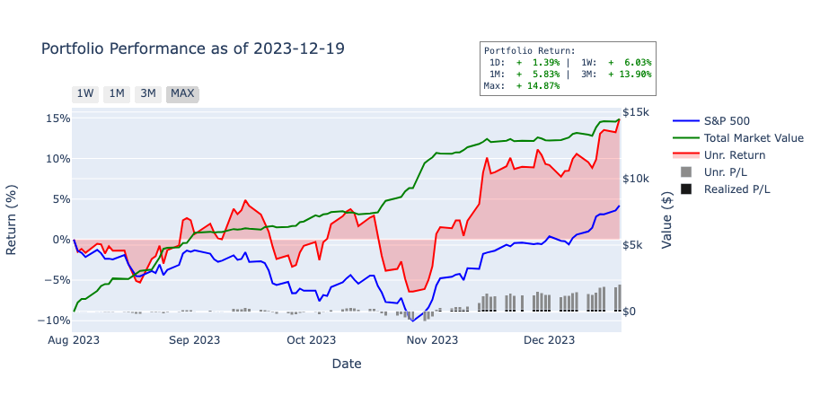
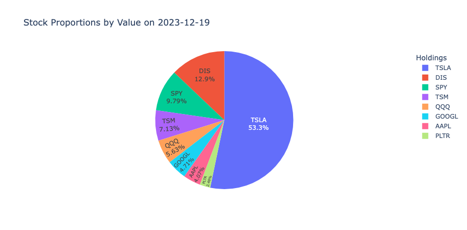
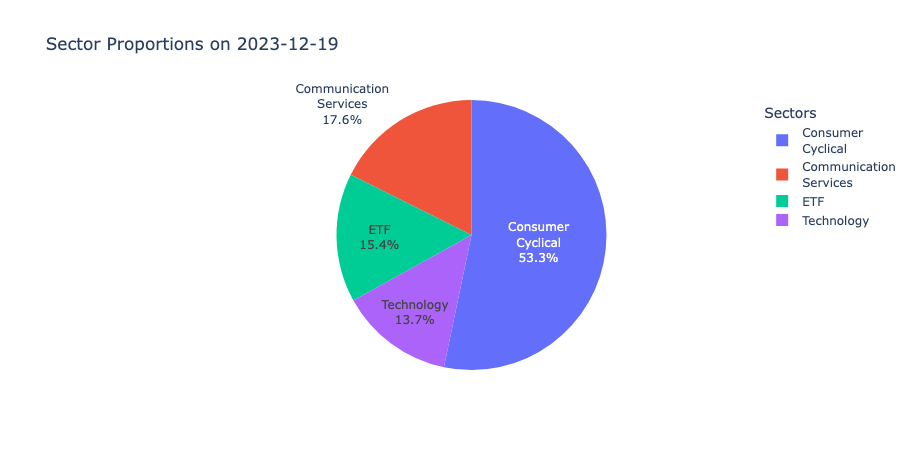

# Firstrade Portfolio Analysis

## Table of Contents

- [Introduction](#introduction)
- [Quick Start](#quick-start)
- [Files](#files)
- [Setup](#setup)
- [Usage](#usage)
- [Features](#features)
- [Visualizations](#visualizations)
- [Example Output](#example-output)
- [Note](#note)
- [Appendix: Output File Structures](#appendix-output-file-structures)

## Introduction

This project offers a comprehensive suite of Python scripts and a Jupyter notebook for in-depth analysis and visualization of your Firstrade investment portfolio. By meticulously reconstructing your complete transaction history from the Firstrade CSV file, it enables:

- Precise tracking of your portfolio's evolution from the very first trade
- Detailed performance analysis over any time period
- Accurate calculation of returns, including the compounding effects of dividends and reinvestments
- Proper handling of corporate actions like stock splits
- Insights into how different transaction types have impacted your overall performance

## Quick Start

1. Install requirements: `pip install -r requirements.txt`
2. Place your Firstrade CSV file as `FT_History.csv` in the project directory
3. Run `python ft_history_processor.py`
4. Run `python transaction_history_processor.py`
5. Open `portfolio_analysis_dashboard.ipynb` in Jupyter

## Files

1. **portfolio_analysis_dashboard.ipynb**:
   This Jupyter notebook provides an interactive dashboard for analyzing your portfolio. It visualizes portfolio composition, performance metrics, and historical trends using interactive Plotly charts.

2. **transaction_history_processor.py**:
   This Python script processes the transaction history from Firstrade, calculates portfolio states, and provides methods for viewing and saving portfolio data.

3. **ft_history_processor.py**:
   This script handles the initial processing of the Firstrade CSV history file, converting it into a structured JSON format for further analysis.

## Setup

1. Install required packages:

   ```
   pip install -r requirements.txt
   ```

2. Download your transaction history from Firstrade as a CSV file and rename it to `FT_History.csv`. Place this file in the same directory as the scripts.

## Usage

1. Run the `ft_history_processor.py` script to convert the CSV file to a JSON format:

   ```
   python ft_history_processor.py
   ```

2. Run the `transaction_history_processor.py` script to process the JSON data and calculate portfolio states:

   ```
   python transaction_history_processor.py
   ```

3. Open the `portfolio_analysis_dashboard.ipynb` notebook in Jupyter Lab or Jupyter Notebook to interact with the dashboard and analyze your portfolio.

## Features

- Transaction history processing from CSV to JSON
- Portfolio state calculation and historical tracking
- Integration with yfinance for fetching market data
- Interactive Plotly visualizations of portfolio composition and performance
- Analysis of individual stock performance within the portfolio
- Comparison of portfolio performance against S&P 500 benchmark
- Generation of HTML reports for portfolio analysis

## Visualizations

The dashboard features interactive Plotly charts, allowing for:

- Stock proportions by value
- Sector proportions
- Portfolio performance vs S&P 500
- Zooming and panning on all charts
- Hovering over data points for detailed information
- Comparing portfolio performance against S&P 500 benchmark
- Adjustable date ranges for focused analysis
- Sector breakdown with detailed stock information on hover

Sample visualizations:

<div style="display: flex; flex-direction: column; align-items: center;">
  
  
  
  
</div>

These visualizations are examples of the interactive charts generated by the Jupyter notebook.

## Example Output

The notebook generates various visualizations and tables, including:

- Stock proportions pie chart
- Sector proportions pie chart
- Portfolio performance vs S&P 500 line chart
- Detailed portfolio holdings table
- Closed positions table
- Portfolio summary statistics

| Symbol | Quantity | Unit Cost | Market Price | Total Cost | Market Value | Unrealized G/L   | Daily Gain     |
| ------ | -------- | --------- | ------------ | ---------- | ------------ | ---------------- | -------------- |
| AAPL   | 10.00    | $150.00   | $175.00      | $1,500.00  | $1,750.00    | $250.00 (16.67%) | $25.00 (1.43%) |
| GOOGL  | 5.00     | $2,000.00 | $2,100.00    | $10,000.00 | $10,500.00   | $500.00 (5.00%)  | $50.00 (0.48%) |
| MSFT   | 15.00    | $200.00   | $220.00      | $3,000.00  | $3,300.00    | $300.00 (10.00%) | $30.00 (0.91%) |

### Portfolio Summary:

- Cash: $5,000.00
- Total Market Value: $20,550.00
- Invested Value: $19,500.00
- Unrealized Gain/Loss: $1,050.00 (5.38%)
- Daily Gain: $105.00 (0.51%)

### Closed Positions

| Symbol | Quantity | Sell Price | Cost Basis | Realized Gain    |
| ------ | -------- | ---------- | ---------- | ---------------- |
| TSLA   | 2.00     | $800.00    | $700.00    | $200.00 (14.29%) |
| AMZN   | 1.00     | $3,200.00  | $3,000.00  | $200.00 (6.67%)  |

Total Realized Gains: $400.00 (10.81%)

## Note

Ensure that your Firstrade history file (`FT_History.csv`) is up to date for the most accurate analysis. The scripts and notebook use this file as the primary data source for all calculations and visualizations.

## Appendix: Output File Structures

The scripts generate two main output files:

- `transaction_history.json`: Processed transaction data
- `portfolio_history.json`: Calculated portfolio states with market data

### transaction_history.json Structure

The `transaction_history.json` file contains a detailed record of all transactions processed from the Firstrade CSV file. Here's an overview of its structure:

```json
{
  "2023-05-15": {
    "buy": {
      "AAPL": [
        {
          "quantity": 10,
          "price": 150.0,
          "amount": 1500.0
        }
      ]
    },
    "sell": {
      "GOOGL": [
        {
          "quantity": 5,
          "price": 2500.0,
          "amount": 12500.0
        }
      ]
    },
    "reinvestment": {
      "SPY": [
        {
          "quantity": 1.5,
          "price": 400.0,
          "amount": 600.0
        }
      ]
    },
    "split": {
      "TSLA": {
        "quantity": 2
      }
    },
    "deposit": 5000.0,
    "interest": 10.5,
    "dividend": 100.0
  }
}
```

### portfolio_history.json Structure

The `portfolio_history.json` file contains a detailed record of your portfolio's state over time. Here's an overview of its structure:

```json
{
  "timestamp": "2024-08-16T00:00:00.000000",
  "sectors": {
    "AAPL": "Technology",
    "TSLA": "Consumer Cyclical",
    "SPY": "ETF"
  },
  "portfolios": {
    "2024-08-16": {
      "summary": {
        "cash": 118.33,
        "total_deposits": 39000.0,
        "total_value": 48744.67202,
        "total_market_value": 48626.34202,
        "total_cost_basis": 40876.88142,
        "total_unrealized_pnl": 7749.4606,
        "total_unrealized_return": 0.189580524,
        "total_realized_pnl": 1837.051419,
        "total_realized_return": 0.04710388254,
        "total_daily_change": 433.4006652,
        "total_daily_return": 0.008971005173
      },
      "holdings": {
        "TSLA": {
          "quantity": 70.0,
          "cost_basis": 14095.42,
          "average_cost": 201.3631429,
          "market_price": 216.1199951171875,
          "market_value": 15128.39966,
          "unrealized_pnl": 1032.97966,
          "unrealized_return": 0.07328477335,
          "daily_change": 138.5997,
          "daily_return": 0.009246267487
        }
      },
      "closed_positions": {
        "SONY": {
          "close_date": "2023-10-24",
          "quantity": 2.0,
          "cost_basis": 165.8,
          "realized_pnl": 1.93,
          "realized_return": 0.01164053076
        }
      },
      "partially_sold_positions": {
        "TSLA": {
          "last_sell_date": "2023-12-27",
          "quantity": 5.0,
          "cost_basis": 1078.73,
          "realized_pnl": 221.25,
          "realized_return": 0.2051022962
        }
      }
    }
  }
}
```
